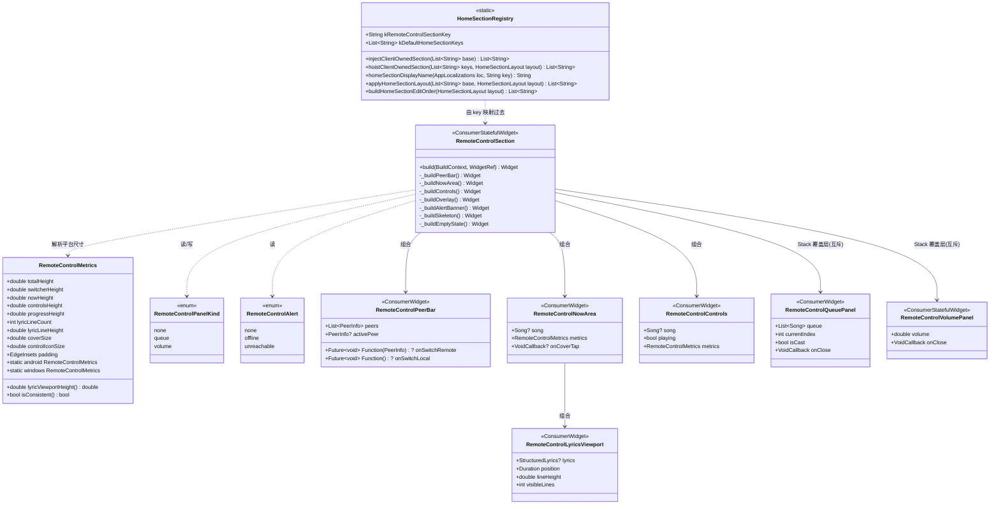
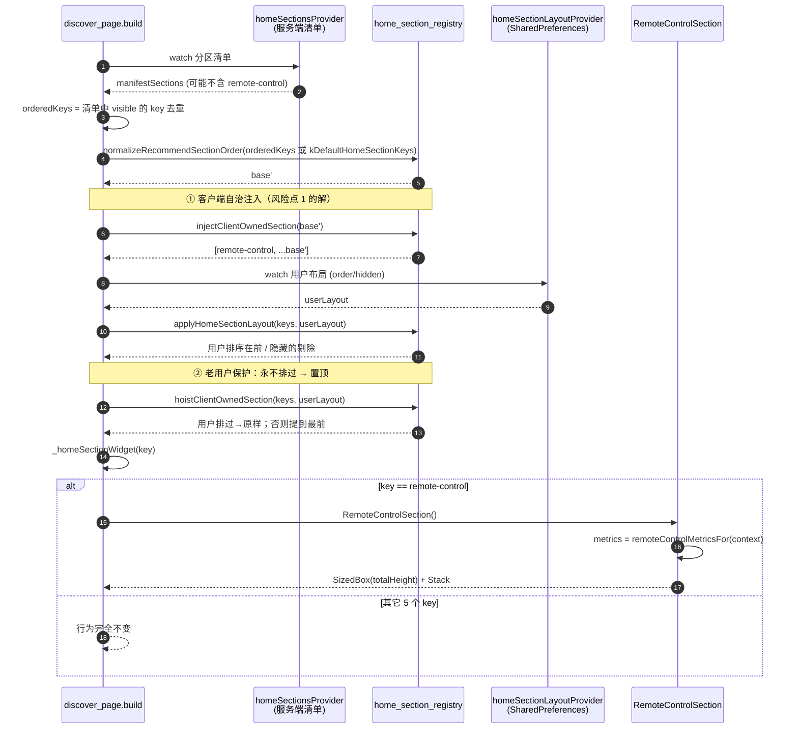
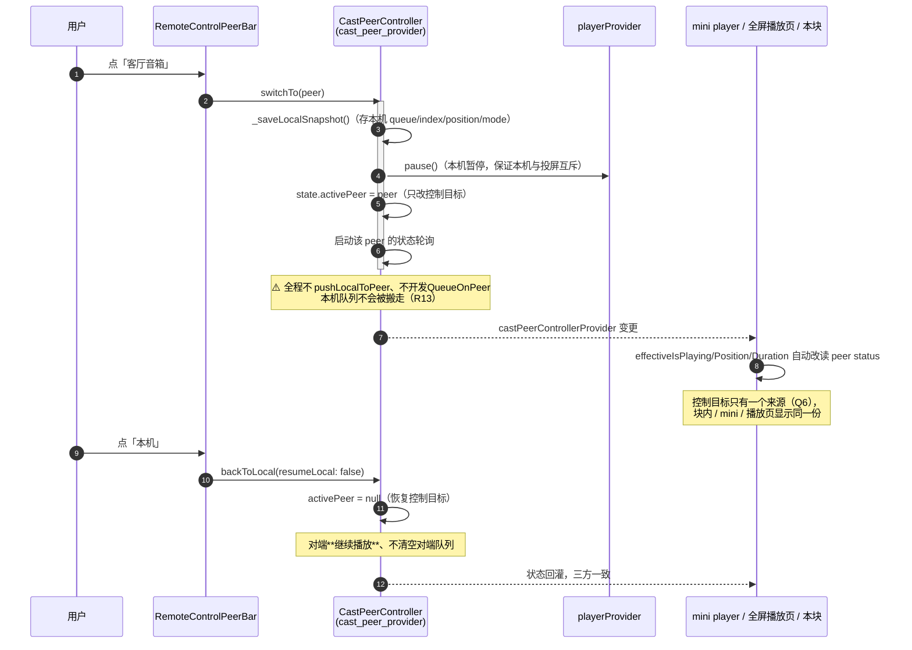
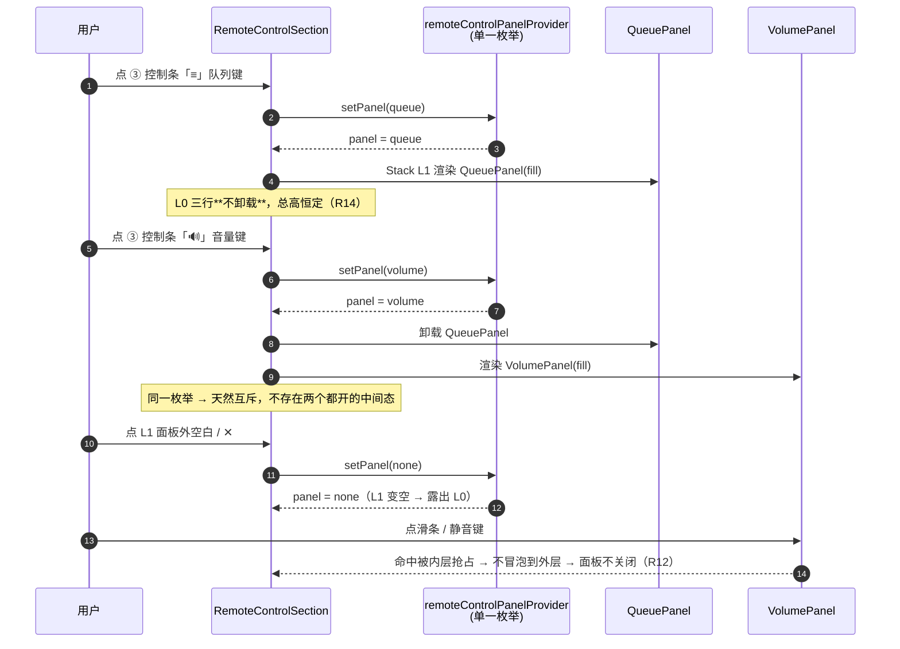

# 首页「HA 卡片整体块」架构设计

> 作者：高见远（架构师） · 面向：寇豆码（工程师） · 状态：待评审
> 上游：`docs/首页HA卡片整体块-PRD.md`（R1~R27 / D1~D5 / Q1~Q10）
> 参照物：HA 自定义卡片 `hass-musicflow-card/src/musicflow-remote-card.js` —— **只作为「皮」**（视觉布局、按钮位置与图标、面板互斥交互、信息层级）
> 硬边界：**不改服务端、不动 HA 卡片仓库、不引入任何 HA entity / WebSocket / service call**。块内所有操控与显示链路全部接客户端现有 provider / 组件。

---

## 0. 一份话读懂本设计

**路线**：「客户端自治分区注入」+「现有 effective_* 链路门面」+「固定尺寸 Stack 分层」。

三句话：

1. **分区怎么出现**：`remote-control` 是**客户端自治分区**，不依赖服务端清单。在 `discover_page` 计算 base 列表时由客户端无条件注入并置顶（`injectClientOwnedSection` / `hoistClientOwnedSection` 两个纯函数），用户的隐藏与排序仍由现有 `applyHomeSectionLayout` 兜住。
2. **骨怎么接**：块内**不 new 任何播放链路**。操控一律走 `effective_playback_provider.dart` / `effective_volume.dart` 这两个**已有的统一入口**（它们内部按 直投 > 投屏 peer > 本机 路由到 `player_provider` / `cast_peer_provider` / `dlna_provider`）；显示一律读 `effective*Provider` 与 `playerProvider`，与 mini player、全屏播放页**同一份**。
3. **皮怎么画**：整块是一个固定高度容器 + `Stack` 分层（切换器 / Now 区 / 控制条 为底层三行，队列 / 音量面板为顶层覆盖层），所有状态（空态、骨架、告警、面板开合）都在这个固定高度盒子内替换，**任何状态都不改变块高**。

**为什么选「客户端自治注入」而不是「后端下发清单」**：该块是**纯客户端能力**（遥控器视图），后端没有对应数据源；若要求后端在 `home_sections` 清单里加一行，则本次变更要等后端发版、且老版本服务端永远拿不到 → D4「默认置顶可见」对存量用户直接失效。注入点只有一处（`discover_page` 算 base 列表的地方），改动 ≤8 行，且与「用户隐藏 / 用户排序」语义完全正交。

---

## 1. 链路映射表（团队长追加要求）

> 表中所有行号基于当前 `main`（`e47461a`），以实际代码为准。
> 说明：块内**优先调用 `effective_*` 门面函数**而非直接调 `playerProvider`。原因是这些门面本身就是**客户端现有的链路**，内部已实现「直投 > 投屏 > 本机」三级路由；直接调 `playerProvider` 会在控制远端设备时失效。二者不是两套东西，而是**同一个链路的统一入口**。

### 1.1 操控映射

| # | 块内操作 | 块内调用入口（唯一） | 实际落到的客户端现有方法 |
|---|---|---|---|
| C1 | 播放 / 暂停 | `toggleEffectivePlayback(ref)`<br>`effective_playback_provider.dart:89` | 直投 `dlnaCast.notifier.toggle()`；投屏 `castPeer.toggle()`（:1162，内部 `play()`/`pause()` :1182）；本机 `playerProvider.pause()`（:1861）/ `play()`（:1889） |
| C2 | 上一首 | `previousEffectivePlayback(ref)` | `castPeer.previous()`（:1248）/ `playerProvider.previous()`（:1940） |
| C3 | 下一首 | `nextEffectivePlayback(ref)` | `castPeer.next()`（:1239）/ `playerProvider.next()`（:1987） |
| C4 | 拖进度 seek | `seekEffectivePlayback(ref, position)` | `castPeer.seek()`（:1257）/ `playerProvider.seek()`（:2167）/ `dlnaCast.seek()` |
| C5 | 播放模式循环 | `cycleEffectivePlayMode(ref)` | `castPeer.cyclePlayMode()`（:1340）/ `playerProvider.cyclePlaybackMode()`；直投 `dlnaCast.cyclePlayMode()` |
| C6 | 音量**拖动中**（实时跟手） | `ThrottledVolumeSender(onSend: (v) => setEffectiveVolume(ref, v, live: true))`<br>`effective_volume.dart:100` | 本机 `playerProvider.setVolumeLive()`（:1833，不落盘）；投屏 `castPeer.setVolume(int 0-100)`（:1310）；直投 `dlnaCast.setVolume()` → `soap_control.dart` / `dlna_manager.dart` |
| C7 | 音量**松手**提交最终值 | `setEffectiveVolume(ref, v)`（`live: false`，默认） | 本机 `playerProvider.setVolume()`（:1804，落盘）；投屏 `castPeer.setVolume(int)`（:1310）；直投 SOAP |
| C8 | 静音键 | ⚠️ **见缺口 G-1**；v1 建议：静音 = `setEffectiveVolume(ref, 0.0)`，取消静音 = 回写本地记住的静音前值 | 投屏 `castPeer.setMuted(bool)`（:1320）/ 直投 `dlnaCast.setMuted()`（:680）；**本机 `playerProvider` 无 `setMuted`** |
| C9 | 收藏（♡） | `ref.read(playerProvider.notifier).toggleFavorite()`（:2543） | `_favoriteHandler.toggleSongFavorite` → 既有 star / unstar 仓储（与全屏播放页同一颗按钮） |
| C10 | 队列点某首跳播 | 投屏：`castPeer.jumpTo(index)`（:1592）；本机：`playerProvider.skipToQueueItem(index)`（:2238） | 与 `play_queue_sheet.dart` 完全同路，不另写 |
| C11 | 队列删一项 | 投屏：`castPeer.removeQueueItem(i)`（:1600）；本机：`playerProvider.removeFromQueue(i)`（:2451） | 同上 |
| C12 | 清空队列（二次确认，Q9） | 投屏：`castPeer.clearCastQueue()`（:1625）；本机：`playerProvider.clearQueue()`（:2393） | 同上；确认弹窗复用 `MusicFlowBottomSheet` / 现有 destructive 确认写法 |
| C13 | 队列拖拽排序 | 投屏：`castPeer.reorderQueue(from, to)`（:1617） | ⚠️ 本机队列无等价 public 方法 → **缺口 G-3**，本需求不做（R25 属 P2） |
| C14 | 切到某个播放端 | `castPeer.switchTo(peer)`（:600，注释始于 :592） | 纯 UI 控制目标切换：内部存本机快照 + 暂停本机，**不推队列、不投屏** |
| C15 | 切回本机 | `castPeer.backToLocal(resumeLocal: false)`（:630，注释始于 :624） | 仅恢复控制目标；对端**继续播**、不清空对端队列 |
| C16 | 刷新设备列表 | `ref.invalidate(remoteControlPeersProvider)`（内部再调 `castPeer.loadPeers()` :572） | 后端自身持续扫描并维护 `available`，客户端**不触发** `dlna/scan` |

### 1.2 显示映射

| # | 块内显示 | 读的现有 provider / 纯函数 | 备注 |
|---|---|---|---|
| D1 | 当前控制目标是谁（切换器高亮项） | `castPeerControllerProvider.select((s) => s.activePeer)`（`null` = 本机） | **唯一来源**（Q6），块内不存第二份 |
| D2 | 可选播放端列表 | `remoteControlPeersProvider`（新增薄壳，取 `castPeer.loadPeers()` 结果）+ `comparePeerDisplayOrder` 排序（`peer_display_order.dart`，**唯一实现**） | 过滤口径：仅 `p.available`（离线不参与选择，对齐 HA `available !== false`）；**本机由 `p.self` 识别**（不可用 `kind=='local'` 一刀切） |
| D3 | 设备的第二行（曲名/未在播放） | `peerNowPlayingProvider(peerId)`（`:2111`） | 复用 `PeerCastRow` 已有的 on-demand 订阅思路 |
| D4 | 曲目名 / 艺术家 / 封面 | `playerProvider.select((s) => s.currentSong)` | 投屏态下 `cast_peer_provider.syncQueueForCast()` 已把后端权威队列**镜像进 playerProvider**，因此**本机与远端共用这一个来源** |
| D5 | 是否在播放 | `effectiveIsPlayingProvider` | 三条链路统一 |
| D6 | 进度 / 总时长 | `effectivePositionProvider` / `effectiveDurationProvider` | 内含 500ms（桌面）/250ms（手机）插值 tick，天然平滑不跳秒（R7） |
| D7 | 歌词数据 | `currentLyricsProvider`（`lyrics_cover_provider.dart:134`）→ `lyrics.getBest()` 取 `StructuredLyrics` | 已含离线缓存回退逻辑，不要自己重写 |
| D8 | 当前歌词行下标 | `syncedLyricIndexFor(StructuredLyrics, position)`（`synced_lyrics_view.dart:41`，**public 纯函数**） | 现有异步滚动歌词 ListView 的 96dp 上下 padding 不适合 104dp 视口，故只复用它的纯函数（见 §3.4） |
| D9 | 双语行拆分（原文 / 译文） | `lyricLineParts(String raw)`（`synced_lyrics_view.dart:81`，**public 纯函数**） | 同上 |
| D10 | 播放模式图标 | 投屏：`castPeer...select((s) => s.playMode)`；本机：`playerProvider.select((s) => s.playbackMode)` | 与 mini player 图标取法一致 |
| D11 | 收藏高亮 | `playerProvider.select((s) => s.currentSong?.starred)` | 由 C9 回写，同一份 |
| D12 | 音量值 / 百分比 | `effectiveVolumeProvider`（`effective_volume.dart:40`） | 投屏取设备回报值，未回报回退本机；这个回落口径已经是现有实现 |
| D13 | 队列列表 | 投屏：`castPeer...select((s) => (castQueue, castIndex))` + `castQueueItemToSong`（`peer.dart:244`）；本机：`playerProvider.select((s) => (queue, currentIndex))` | 与 `PlayQueueSheet` 同口径 |
| D14 | 告警条（离线 / 连接恢复中 / 无法连接） | `isOfflineProvider` + `castPeerControllerProvider.select((s) => s.offline)` | 纯派生，不 new provider |
| D15 | 加载骨架开关 | `remoteControlPeersProvider` 的 `AsyncLoading` | `autoDispose`：块隐藏即 dispose → **天然零请求**（R22） |

### 1.3 客户端确实没有的能力（缺口，**不自行发明，交 team-lead 决策**）

| 编号 | 缺口 | 现状 | 建议默认值 |
|---|---|---|---|
| **G-1** | **统一静音入口缺失** | 仅 `castPeer.setMuted(:1320)`、`dlnaCast.setMuted(:680)`；**本机无 `setMuted`**。`effective_volume.dart` 也只覆盖音量，无 muted | **建议 v1 不实现真正的静音**：块内静音键 = 把音量置 0 并记住原值、再点时恢复。若要真正的 "mute" 需在 `playerProvider` 补 `muted` 字段 + `setEffectiveMuted` 门面 —— 属**客户端链路补强**，不在本需求范围，需单独排期 |
| **G-2** | **peers 列表没有 provider 托管** | `loadPeers()` 的返回值目前只存在 `PlayerSwitcherSheet._peers` 的局部 state 里 | 新增**薄壳** `remoteControlPeersProvider`（`FutureProvider.autoDispose` 包一层 `loadPeers()`），不改写 `cast_peer_provider`。若 team-lead 认为该 provider 应上提到 `providers/cast/`，请指示，我再调整落点 |
| **G-3** | **本机队列拖拽排序无 public 方法** | `CastQueueSheetView` 走 `castPeer.reorderQueue`；本机分支只有删除、无 reorder | 本需求不做（R25 是 P2）。块内面板在本机态下不提供拖拽把手 |
| **G-4** | **「连接恢复中」分级信号** | 客户端有 `isOfflineProvider`（二元），没有 HA 的「WS 断开→REST 兜底」中间态 | 建议 v1 只做两级：**完全不可达 → 告警条「无法连接」**；**投屏态 `offline=true` → 告警条 + 切换器该项标灰**。中间态「连接恢复中」降级不实现（不 new 信号源） |

---

## 2. 实现方案要点

### 2.1 分区注入（解决 PM 标出的风险点 1 / 2）

```dart
// lib/features/discover/home_section_registry.dart（新增两个纯函数）
const String kRemoteControlSectionKey = 'remote-control';

/// ① 客户端自治分区注入：无论服务端清单含不含它，都注入到最前。幂等。
List<String> injectClientOwnedSection(List<String> baseKeys);

/// ② 老用户保护：用户**从未排过**该 key 时强制置顶；
///    用户排过 → 原样返回（尊重用户位置）。
List<String> hoistClientOwnedSection(List<String> keys, HomeSectionLayout layout);
```

`discover_page.dart` 只加两行包裹（**不改 `applyHomeSectionLayout` 本身**）：

```dart
final baseSectionKeys = injectClientOwnedSection(          // ← 新增
  normalizeRecommendSectionOrder(
    orderedKeys.isEmpty ? kDefaultHomeSectionKeys : orderedKeys,
  ),
);
final userLayout = ref.watch(homeSectionLayoutProvider).valueOrNull
    ?? HomeSectionLayout.empty;
final sectionKeys = hoistClientOwnedSection(               // ← 新增
  applyHomeSectionLayout(baseSectionKeys, userLayout),
  userLayout,
);
```

**为什么必须是两个（而不是一个）**：
- ① 解决「服务端清单非空且不含该 key → 永不渲染」（风险点 1）；
- ② 解决**存量用户**的隐蔽坑：`applyHomeSectionLayout` 的语义是「用户排过序的在前，未排过的追加**尾部**」。老用户已存过一份只含旧 5 项的 `order`，升级后 `remote-control` 属于「未排过」→ 会被追加到**尾部**，D4「默认置顶」对存量用户静默失效。② 专门兜这个。

**编辑页（风险点 2）**：把 key 加进 `kDefaultHomeSectionKeys` 首位即可自动生效，`buildHomeSectionEditOrder()` **零改动**（它遍历的就是这个常量）。同时该常量也是「清单未就绪时的回落顺序」，新 key 置顶 → R2「清空 layout 后冷启动块在最前」自动成立。

### 2.2 固定高度（D3 / R14）

整块是一个 `SizedBox(height: metrics.totalHeight)` + 内部 `Stack`：

| 层 | 内容 | 高度 | 面板打开时 |
|---|---|---|---|
| L0 底层 | ① 切换器 + ② Now 区 + ③ 控制条/进度条 | 恒定三行 | **保留原位、不卸载**（只会被上层遮住） |
| L1 覆盖层 | ④ 队列面板 / ⑤ 音量面板 | `Positioned.fill` | 互斥，**同一时刻最多一个**（单一枚举状态，见 §4） |

等价 HA 的做法：HA 用 `volmode` 的 `visibility:hidden` 保留占位 + `.meta` 的 `min-height:104px`；客户端这里是 `SizedBox` 定死 + `Stack` 覆盖 + 底层不卸载，效果一致且更简单。

**所有**状态（空态 / 骨架 / 告警 / 有无歌词 / 面板开合 / 曲目长短）都在同一个 L0 盒子内替换 inner child，盒子本身高度恒定 → 首页后续分区零位移。

### 2.3 平台差异（D5 / Q3 / R19 / R20）

断点沿用 `context.musicFlowWindowClass`（`music_flow_context.dart:58`），**仅 `expanded`（宽 ≥ 840）** 走放大态，`compact/medium` 同 Android 尺寸。单列加高，**不做半栏、不做歌词与队列并排**。左右边距用 `context.musicFlowPageHorizontalPadding - 5`（与 `discover_page` 现有 SliverPadding 完全同一个表达式）→ R19 天然对齐。

---

## 3. 文件列表

### 3.1 修改（4 个 + 生成物）

| 相对路径 | 改动性质 | 职责 | 预估改动量 |
|---|---|---|---|
| `lib/features/discover/home_section_registry.dart` | **修改** | 新增 `kRemoteControlSectionKey`；`kDefaultHomeSectionKeys` 首位插入它（5→6 项）；新增 `injectClientOwnedSection` / `hoistClientOwnedSection` 两个纯函数；`homeSectionDisplayName` 加一个 `case`；更新注释（「5 个分区」→「6 个」） | +45 行 / -3 行 |
| `lib/features/discover/pages/discover_page.dart` | **修改** | 307~323 行加两行包裹；`_homeSectionWidget()`（:70）switch 加 `case kRemoteControlSectionKey => const RemoteControlSection()`。其余（`topInset` switch、`separatorBuilder`、血压诊断瘟疫逻辑）**一律不动** | +8 行 |
| `lib/l10n/app_zh.arb` | **修改** | 新增 ~14 组 key（模板 arb，必须带 `@` 描述） | +42 行 |
| `lib/l10n/app_en.arb` | **修改** | 与 zh **键集合完全一致**（`tool/check-l10n.mjs` 强校验：缺键/多键直接 fail） | +42 行 |
| `lib/l10n/generated/app_localizations.dart`<br>`app_localizations_zh.dart`<br>`app_localizations_en.dart` | **生成入库** | 在 230 上跑 `flutter gen-l10n` 后 **必须随 commit 提交**（`git ls-files lib/l10n` 证实生成物已在版本库里） | 自动生成 |

### 3.2 新增（5 个，全部落在 `lib/features/discover/` 与 `lib/providers/ui/`）

| 相对路径 | 改动性质 | 职责 | 预估体量 |
|---|---|---|---|
| `lib/features/discover/widgets/remote_control_metrics.dart` | **新增** | 平台尺寸常量 + `RemoteControlMetrics` 数据类 + `remoteControlMetricsFor(BuildContext)`；含 `assertRegionSum()` 不变量自检（供单测锁定） | ~90 行 |
| `lib/providers/ui/home_remote_control_provider.dart` | **新增** | `remoteControlPeersProvider`（薄壳 `FutureProvider.autoDispose` 包 `loadPeers()`）、`remoteControlTargetsProvider`（过滤 + `comparePeerDisplayOrder` 排序）、`remoteControlPanelProvider`（面板互斥枚举）、`remoteControlAlertProvider`（告警分级派生） | ~110 行 |
| `lib/features/discover/widgets/remote_control_section.dart` | **新增** | 分区外壳：`ConsumerStatefulWidget`。平台尺寸解析 → 固定高度盒 → L0 三行 + L1 覆盖层的 `Stack` → 加载骨架 / 空态 / 告警条 /「点面板外空白关闭」手势。**它是唯一被 `discover_page` 引用的类** | ~320 行 |
| `lib/features/discover/widgets/remote_control_body.dart` | **新增** | L0 三个 widget：`RemoteControlPeerBar`（① 切换器横排 chip）、`RemoteControlNowArea`（② 封面 + 曲名/艺术家 + 歌词视口 `RemoteControlLyricsViewport`）、`RemoteControlControls`（③ 7 键 + `MusicFlowProgressBar` + 时间文本） | ~380 行 |
| `lib/features/discover/widgets/remote_control_panels.dart` | **新增** | L1 两个面板：`RemoteControlQueuePanel`（④ 队列）、`RemoteControlVolumePanel`（⑤ 静音键 + `MusicFlowSlider`） | ~240 行 |

### 3.3 明确不改

- ❌ `lib/providers/cast/cast_peer_provider.dart`（`switchTo` / `backToLocal` 直接复用，**不碰**）
- ❌ `lib/providers/player/player_provider.dart`
- ❌ `lib/features/player/widgets/*`（`player_switcher.dart` / `volume_button.dart` / `synced_lyrics_view.dart` / `play_queue_sheet.dart` 只读复用其 public 纯函数与 controller 方法，不改它们的 build）
- ❌ 服务端、HA 卡片仓库

### 3.4 已核实可复用组件的结论表（PM 已摸清，此处给结论）

| 组件 | 结论 | 理由 / 替代做法 |
|---|---|---|
| `synced_lyrics_view.dart` 的 `SyncedLyricsSurface` | **不整体复用**（只用其两个 public 纯函数） | 它的 `ScrollablePositionedList` 有 `EdgeInsets.symmetric(vertical: xxl*2)` = **上下各 48dp** 的 padding（`lyrics_view.dart:324`），在 104dp 的 Now 区里几乎看不到字；且它的滚动对齐是 `alignment: 0.47`（居中），不是 HA 的「当前行固定第 2 槽」。改用这两条公模纯函数 + 自建紧凑视口，成本 ~90 行 |
| `play_queue_sheet.dart` 的 `PlayQueueSheet(panel: true)` | **先按默认方案复用**，见 U-2 | 它已内建「投屏 / 直投 / 本机」三态路由，复用它最省事也最不容易错。但它的 header/footer 吃掉约 112dp，在 188dp 高的区域内列表只剩 **1 行**（`_rowExtent` = cover 48 + xs*2 = 64dp）。→ 让面板覆盖**整块 280dp** 后仍有约 3 行；若实测 <3 行再切备选方案 |
| `volume_button.dart` 的 `VolumeButton` | **不复用**（它是「按钮 + 根 Overlay 弹窗」的组合，无法内联成行内滑条） | 复用它的**链路**：`effectiveVolumeProvider` + `setEffectiveVolume(ref, v, live:)` + `ThrottledVolumeSender`，三者本来就抽在 `effective_volume.dart` 里。UI 用现有 `MusicFlowSlider` 现画 |
| `player_switcher.dart` 的 `PlayerSwitcherSheet` | **不复用**（半屏 BottomSheet） | 但复用它内部的两个资产：`comparePeerDisplayOrder`（`peer_display_order.dart`，注释明确要求「唯一实现，别内联副本」）与 `p.self` 识别本机、`p.available` 过滤离线的口径 |

---

## 4. 数据结构与接口（Dart 签名）

### 4.1 类图



### 4.2 关键签名

```dart
// ============ home_section_registry.dart（修改） ============
/// 首页「播放控制」整体块 —— 客户端自治分区 key。
/// ⚠️ key 落库即持久化数据，改名要做迁移，一次定死。
const String kRemoteControlSectionKey = 'remote-control';

const List<String> kDefaultHomeSectionKeys = <String>[
  kRemoteControlSectionKey,   // ← 置顶（客户端自治）
  'random-songs',
  'recent-playlists',
  'home-recommend',
  'local-recommend',
  'platform-recommend',
];

/// 注入客户端自治分区到 base 列表最前。幂等（已存在则返回原 list）。
/// 服务端清单无论含不含该 key，它都会出现 → 风险点 1 的解。
List<String> injectClientOwnedSection(List<String> baseKeys) {
  if (baseKeys.contains(kRemoteControlSectionKey)) return baseKeys;
  return <String>[kRemoteControlSectionKey, ...baseKeys];
}

/// 用户**从未排过**该 key 时强制提到最前（覆盖 applyHomeSectionLayout 的
/// 「未排过 → 追加尾部」语义）；用户排过则原样返回，尊重用户位置。
List<String> hoistClientOwnedSection(
  List<String> keys,
  HomeSectionLayout layout,
) {
  if (!keys.contains(kRemoteControlSectionKey)) return keys;          // 被隐藏
  if (layout.order.contains(kRemoteControlSectionKey)) return keys;   // 用户排过
  return <String>[
    kRemoteControlSectionKey,
    ...keys.where((k) => k != kRemoteControlSectionKey),
  ];
}
```

```dart
// ============ remote_control_metrics.dart（新增） ============
@immutable
class RemoteControlMetrics {
  const RemoteControlMetrics({
    required this.totalHeight,
    required this.switcherHeight,
    required this.nowHeight,
    required this.controlsHeight,
    required this.progressHeight,
    required this.lyricLineCount,
    required this.lyricLineHeight,
    required this.coverSize,
    required this.controlIconSize,
    required this.padding,
    required this.gap,
  });

  /// Android / compact / medium（Q5）。
  static const RemoteControlMetrics standard = RemoteControlMetrics(
    totalHeight: 280,
    switcherHeight: 40,
    nowHeight: 104,      // 曲名 22 + gap 2 + 歌词 4×20
    controlsHeight: 56,
    progressHeight: 28,
    lyricLineCount: 4,
    lyricLineHeight: 20,
    coverSize: 92,
    controlIconSize: 24,
    padding: EdgeInsets.symmetric(vertical: 16),
    gap: 10,
  );

  /// Windows / expanded（Q3，宽 ≥ 840）。单列加高，不做半栏。
  static const RemoteControlMetrics expanded = RemoteControlMetrics(
    totalHeight: 360,
    switcherHeight: 48,
    nowHeight: 196,      // 曲名 28 + gap 8 + 歌词 8×20
    controlsHeight: 64,
    progressHeight: 30,
    lyricLineCount: 8,
    lyricLineHeight: 20,
    coverSize: 160,
    controlIconSize: 30,
    padding: EdgeInsets.symmetric(vertical: 8),
    gap: 3,
  );

  final double totalHeight;
  final double switcherHeight;
  final double nowHeight;
  final double controlsHeight;
  final double progressHeight;
  final int lyricLineCount;
  final double lyricLineHeight;
  final double coverSize;
  final double controlIconSize;
  final EdgeInsets padding;
  final double gap;

  double get lyricViewportHeight => lyricLineCount * lyricLineHeight;

  /// 不变量：四段高度 + 间隔 + 内边距 == totalHeight（±0.5 容差）。
  /// 单测锁死 —— 任何调错都会让「固定高度」变成「布局溢出/留白」。
  bool get isConsistent =>
      (padding.vertical + switcherHeight + gap + nowHeight + gap +
          controlsHeight + progressHeight - totalHeight).abs() < 0.5;
}

/// 断点：仅 expanded（宽 ≥ 840）走放大态，compact/medium 同 Android。
RemoteControlMetrics remoteControlMetricsFor(BuildContext context) =>
    context.musicFlowWindowClass == MusicFlowWindowClass.expanded
        ? RemoteControlMetrics.expanded
        : RemoteControlMetrics.standard;
```

```dart
// ============ home_remote_control_provider.dart（新增） ============
/// 面板互斥：单一枚举（比两个 bool 更难写错，天然互斥）。
/// autoDispose：块被用户隐藏 → provider 释放 → 列表保留 AutoDispose 语义。
final remoteControlPanelProvider =
    StateProvider.autoDispose<RemoteControlPanelKind>(
  (ref) => RemoteControlPanelKind.none,
);

/// peers 薄壳：现有 loadPeers() 的返回值目前没有 provider 托管（缺口 G-2），
/// 这里只包一层，不改写 cast_peer_provider。
final remoteControlPeersProvider =
    FutureProvider.autoDispose<List<PeerInfo>>((ref) async {
  return ref.watch(castPeerControllerProvider.notifier).loadPeers();
});

/// 切换器候选项：仅 available（离线不入选择，对齐 HA `available !== false`），
/// 排序复用 peer_display_order.dart 的唯一实现。
final remoteControlTargetsProvider = Provider.autoDispose<List<PeerInfo>>((ref) {
  final peers = ref.watch(remoteControlPeersProvider).valueOrNull;
  if (peers == null) return const <PeerInfo>[];
  return peers.where((p) => p.available).toList()..sort(comparePeerDisplayOrder);
});

/// 告警分级（纯派生，不 new 信号源）。
final remoteControlAlertProvider = Provider.autoDispose<RemoteControlAlert>((ref) {
  if (ref.watch(isOfflineProvider)) return RemoteControlAlert.unreachable;
  if (ref.watch(castPeerControllerProvider.select((s) => s.offline))) {
    return RemoteControlAlert.offline;
  }
  return RemoteControlAlert.none;
});
```

```dart
// ============ remote_control_section.dart（新增） ============
/// 首页「播放控制」整体块。唯一被 discover_page 引用的入口。
class RemoteControlSection extends ConsumerStatefulWidget {
  const RemoteControlSection({super.key});
}

class _RemoteControlSectionState extends ConsumerState<RemoteControlSection> {
  @override
  Widget build(BuildContext context, WidgetRef ref) {
    final metrics = remoteControlMetricsFor(context);
    final panel = ref.watch(remoteControlPanelProvider);
    // 结构：SizedBox(totalHeight) → ClipRRect → Stack[ L0 三行, L1 面板 ]
    // L0 任何状态下都构建（骨架/空态也占同样高度），只是内容不同。
  }
}
```

---

## 5. 程序调用流程

### 5.1 首页 build → 注入分区 → 渲染块



### 5.2 切换控制目标 → 状态回灌（不搬队列）



### 5.3 面板互斥（队列 ⇄ 音量）



---

## 6. 任务列表

> **粒度和顺序**：按模块分层，T01 打地基（分区自治 + 注册 + 文案），T02 建骨骼（尺寸 + provider + 固定高度外壳与各态占位），T03/T04 填血肉（主体行 / 覆盖面板），T05 收口（平台 + 无障碍 + 回归）。每个任务 ≥3 个文件，可直接开工。
> **每个任务收尾必跑**：`flutter test`（基线 1289 全绿）+ `node tool/check-l10n.mjs`。

---

### T01 · 分区自治注入 + 注册 + 文案

**优先级**：P0 · **依赖**：无 · **预估**：0.5 天

| 文件 | 做什么 |
|---|---|
| `lib/features/discover/home_section_registry.dart` | ① 新增 `kRemoteControlSectionKey = 'remote-control'`；② `kDefaultHomeSectionKeys` 首位插入它（5→6）；③ 新增 `injectClientOwnedSection` / `hoistClientOwnedSection` 两个纯函数（签名见 §4.2）；④ `homeSectionDisplayName` 加 `case kRemoteControlSectionKey => loc.discover_remote_control`；⑤ 更新注释里的「5 个分区」为「6 个」 |
| `lib/features/discover/pages/discover_page.dart` | ① 307~323 行加两行包裹（`injectClientOwnedSection` 包 `normalizeRecommendSectionOrder(...)`；`hoistClientOwnedSection` 包 `applyHomeSectionLayout(...)`）；② `_homeSectionWidget()` switch 加 case 返回 `const RemoteControlSection()`（此时该文件可先用一个占位的 `SizedBox` 版本，T02 替换为真实实现） |
| `lib/l10n/app_zh.arb` / `app_en.arb` | 新增 `discover_remote_control`（zh「播放控制」/ en「Playback control」，均带 `@discover_remote_control` 描述）。**本任务只加这一个 key**，块内文案集中留给 T02~T04 各自补，或一次性加全也可以（见 §8.3 的 key 清单） |
| `lib/l10n/generated/*` | 在 230 上跑 `flutter gen-l10n`，输出物随 commit 提交 |

**验收口径**
1. **必须改的既有用例**（唯一影响面，写死在这里）：`test/features/discover/home_section_edit_page_test.dart` 第 59/60/102 行硬断言「5 个」→ 编辑页多一行，必须同步改为 **6**：
   - `find.byType(Switch), findsNWidgets(5)` → `findsNWidgets(6)`
   - `find.byType(ReorderableDragStartListener), findsNWidgets(5)` → `findsNWidgets(6)`
   - `expect(order, hasLength(5))` → `hasLength(6)`
   除此外不改动测试的业务断言（拖拽语义、保存语义不动）。
2. `test/features/discover/home_section_registry_test.dart` 现有 6 个用例**全部零改动通过**（base 列表是手工构造的）。
3. 新增纯函数单测（挂在既有 registry 测试文件里）：
   - 清单含 5 项且不含新 key → 注入后 6 项且新 key 在首位；
   - 清单已含新 key → 幂等返回原 list（`same`）；
   - `HomeSectionLayout.empty` → 注入后置顶；
   - 老用户 `order=[random-songs, recent-playlists]` → `hoist` 后新 key 在首位；
   - 用户 `order=[random-songs, remote-control]` → `hoist` 原样返回，尊重用户第 2 位；
   - `hidden=[remote-control]` → base 里已剔除，`hoist` 返回原样。
4. `node tool/check-l10n.mjs` 通过（zh/en 键集合一致）。

---

### T02 · 尺寸 + provider + 固定高度外壳（含骨架 / 空态 / 告警）

**优先级**：P0 · **依赖**：T01 · **预估**：1 天

| 文件 | 做什么 |
|---|---|
| `lib/features/discover/widgets/remote_control_metrics.dart`（新增） | `RemoteControlMetrics` 数据类 + `standard` / `expanded` 两套常量 + `remoteControlMetricsFor(BuildContext)` + `isConsistent` 不变量。数值照抄 §4.2，不要自由发挥 |
| `lib/providers/ui/home_remote_control_provider.dart`（新增） | `remoteControlPanelProvider`（互斥枚举）/ `remoteControlPeersProvider` / `remoteControlTargetsProvider` / `remoteControlAlertProvider`，实现见 §4.2 |
| `lib/features/discover/widgets/remote_control_section.dart`（新增，本任务先做壳） | ① `SizedBox(height: metrics.totalHeight)` + `ClipRRect` + `Stack`；② 加载态骨架（`MusicFlowSkeleton`，**高度 = totalHeight**）；③ 空态 ①「暂无可控制设备」+ 刷新入口（`MusicFlowEmptyState`，复用现有 l10n `player_refresh_players`）；④ 空态 ②「未在播放」；⑤ 告警条（`MusicFlowSurface` 窄条，**出现/消失不改变块高**）；⑥ 「点面板外空白关闭」的 GestureDetector 骨架（T04 接面板） |
| `lib/l10n/app_*.arb` | 补 §8.3 中 `home_remote_*` 全部文案（一次性加全，避免多次跑 gen-l10n） |

**验收口径**
1. 单元：`RemoteControlMetrics.standard.isConsistent == true` 且 `.expanded.isConsistent == true`；`totalHeight` 分别恒等于 280 / 360。
2. 单元：`remoteControlTargetsProvider` 过滤掉 `available=false` 的项；本机那条（`self=true`）**保留**。
3. Widget 测试：三种状态（骨架 / 空态 / 告警）下 `tester.getSize(find.byType(RemoteControlSection)).height` **恒等于 metrics.totalHeight**（±0.5）。这是 R14 的第一道闸。
4. 只有本机一个端时 → 显示「本机」一项并高亮，**不触发空态 ①**（Q7）。

---

### T03 · 主体三行：切换器 / Now 区 / 控制条

**优先级**：P0 · **依赖**：T02 · **预估**：1.5 天

| 文件 | 做什么 |
|---|---|
| `lib/features/discover/widgets/remote_control_body.dart`（新增） | `RemoteControlPeerBar`（横排 chip：`SingleChildScrollView` 横向滚动，项多时换行必禁、不撑高；当前目标用 accent 10% 薄染 + accent 图标，对齐 `PeerCastRow` 的选中态口径）、`RemoteControlNowArea`（封面 + 曲名/艺术家单行省略 + 歌词视口）、`RemoteControlLyricsViewport`、`RemoteControlControls`（7 键 + `MusicFlowProgressBar` + 时间） |
| `lib/features/discover/widgets/remote_control_section.dart` | 把 T02 的三行占位替换为真实 `RemoteControlBody`，并处理「未在播放」时除播放/切端外置灰不可用 |

**验收口径**
1. 7 键齐全：队列 / 模式 / 上曲 / 播放暂停 / 下曲 / 收藏 / 音量；每键 `semanticLabel` 非空。
2. 切换器行高：放 8 个端，`tester.getSize(peerBar).height` 仍恒等于 `switcherHeight`（**不换行、不撑高**）。
3. 歌词视口：`lyricViewportHeight` 内部滚动；有无歌词都**不改变块总高**（无歌词显示「暂无歌词」占满视口，Q4）。
4. 控制/显示全部走 §1 的表：全局搜索本任务的 import，**不得出现**任何 `hass` / HA entity / HA WebSocket 依赖（R18）。
5. 本任务的控制目标切换逻辑只允许走 `castPeer.switchTo` / `backToLocal`，不得接到其它路径 —— 由静态守卫检查（见 §8.6）。

---

### T04 · 覆盖面板：队列 / 音量 + 互斥落地

**优先级**：P0 · **依赖**：T02, T03 · **预估**：1 天

| 文件 | 做什么 |
|---|---|
| `lib/features/discover/widgets/remote_control_panels.dart`（新增） | `RemoteControlQueuePanel`：默认方案复用 `PlayQueueSheet(panel: true, onClose: ...)`（它已内建三态路由，别重写）；用 `MediaQuery.removePadding(removeTop/removeBottom: true)` 抵消它自带的 `SafeArea`，再用 `ClipRect` 卡进固定高度。`RemoteControlVolumePanel`：`MusicFlowSlider` + 静音键（按 G-1 建议值）+ 百分比，拖动走 `ThrottledVolumeSender`（§1.1 C6/C7） |
| `lib/features/discover/widgets/remote_control_section.dart` | ① `Positioned.fill` 挂 L1；② 按 `remoteControlPanelProvider` 三态渲染 nothing/queue/volume；③ 控制条两个按钮改为 `setPanel(...)` 切换（相同值为 toggle 回 none）；④ 「点面板外空白关闭」接上（面板内 `HitTestBehavior.opaque` 抢占，参考 `volume_button.dart:112-126` 的现成写法） |
| `lib/features/discover/widgets/remote_control_body.dart` | 队列/音量按钮的 `selected` 态跟随 `remoteControlPanelProvider` |

**验收口径**
1. 打开任一面板 → 块高恒定（同 T02 第三条的取样写法，多测 3 次：none / queue / volume）。
2. 队列⇌音量切换无缝：任一时刻 L1 只有 0 或 1 个子 widget（`find.byType(RemoteControlQueuePanel)` 与 `find.byType(RemoteControlVolumePanel)` 的 `findsNWidgets` 之和 ≤ 1）。
3. 点面板内列表项/滑条/按钮 → 面板**不关闭**；点面板外空白或 ✕ → 关闭。
4. 清空队列弹二次确认（Q9，走现有 destructive 确认写法）。
5. 队列列表内部滚动**不带动首页滚动**（`ScrollNotification` 不外泄）。
6. 拖音量 → 实时作用于当前控制目标；两端分别验一次（本机 / 投屏任一远端）。

---

### T05 · 平台适配 + 无障碍 + 回归收口

**优先级**：P0 + P1（R19/R20/R21/R23） · **依赖**：T03, T04 · **预估**：0.5 天

| 文件 | 做什么 |
|---|---|
| `lib/features/discover/widgets/remote_control_metrics.dart` | 确认 `expanded` 断点：宽 ≥ 840 → 360dp / 8 行歌词 / 封面 160；< 840 一律走 `standard`。不得出现半栏、不得出现歌词与队列并排（D5） |
| `lib/features/discover/widgets/remote_control_section.dart` + `_body` + `_panels` | ① 左右边距统一用 `context.musicFlowPageHorizontalPadding - 5`（与 `discover_page` 同一个表达式）；② R23：每控件 `semanticLabel`；桌面 Tab 可达、Enter/Space 可触发（`MusicFlowPressable` / `MusicFlowIconButton` 已带 focus，只需补齐 label） |
| 全量回归 | 跑 `flutter test`（基线 **1289 全绿**）+ `flutter analyze` + `node tool/check-l10n.mjs` |

**验收口径**
1. `TestWidgetsFlutterBinding` 设定 `surfaceSize = Size(1200, 900)`（expanded）→ 块高 360；`Size(400, 800)`（compact）→ 块高 280。断言用 `tester.getSize`。
2. 左右边界：断言块左缘 == 同页「随机歌曲」分区左缘（同一 Widget 树内比较 `getTopLeft`）。
3. R21 双向同步（手动 + 自动化）：块内切到客厅音箱 → mini player 同步；在播放页切回本机 → 回到首页块内也已切回。**断言方式**：块内「当前目标 chip 名」与 `MiniPlayer` 上的 `currentPlayerName` 文本一致。
4. R22 隐藏零请求：在编辑页关掉该 block 并保存 → `remoteControlPeersProvider` 未被 watch（用 ProviderContainer 验证无 `loadPeers` 调用），且首页不构建 `RemoteControlSection`。
5. 全量 `flutter test`：**1289 + 本需求新增用例数** 全绿；`flutter analyze` 无新增 warning。

---

## 7. 依赖包

**不需要新增任何 pub 依赖。** 全部落到现有依赖上：

| 用途 | 现有依赖 / 组件 |
|---|---|
| 状态管理 | `flutter_riverpod`（已在用） |
| 滚动歌词稳定传递 | `scrollable_positioned_list`（已在用，但本设计**只复用其两个纯函数**，新建紧凑视口用 `ListView` + `ScrollController` 即可，也可继续用它） |
| 横向切换器 | `SingleChildScrollView`（Flutter SDK） |
| 滑条 / 进度条 / 骨架 / 空态 / 按钮 / 图标按钮 | `MusicFlowSlider` / `MusicFlowProgressBar` / `MusicFlowSkeleton` / `MusicFlowEmptyState` / `MusicFlowButton` / `MusicFlowIconButton`（`lib/core/design/components/`） |
| 图标 | `AppIcons`（`remixicon` + `CupertinoIcons`，已在用） |
| 队列行 | `MusicFlowSongRow`（已有 `standard` variant） |

---

## 8. 共享约定（跨文件必须遵守）

### 8.1 常量集中地

| 东西 | 放哪 | 为什么 |
|---|---|---|
| `kRemoteControlSectionKey = 'remote-control'` | `home_section_registry.dart` | key 是持久化数据，**全仓唯一定义**，任何地方不许写字面量 `'remote-control'` |
| 平台尺寸（280 / 360 / 8 行 / 160 …） | `remote_control_metrics.dart` 的 `RemoteControlMetrics.standard/.expanded` | 散落在 widget 里就没法保证各态高度一致了 |
| 面板互斥状态 | `home_remote_control_provider.dart` 的 `remoteControlPanelProvider` | **单一枚举**；禁止在 widget 里用 `bool showQueue / showVolume`（两个 bool 会出现两个都 true 的脏态） |

### 8.2 命名规范

- 文件名：`remote_control_*.dart`（snake_case，与现有 `random_songs_section.dart` 同风格）
- 对外类：`RemoteControl*`；内部私有类：`_RemoteControl*` 或 `_XxxPart`
- 尺寸常量访问一律经 `remoteControlMetricsFor(context)`，**不得**在各 widget 里写裸数字 `280.0` / `360.0`
- Provider：`remoteControlXxxProvider`

### 8.3 l10n（`tool/check-l10n.mjs` 守卫）

1. **zh 与 en 键集合必须完全一致**（缺 / 多 → 直接 fail），且都要带 `@xxx` 的 `description`。
2. `lib/` 下除 `l10n/` 外**不得有硬编码 CJK**（当前只上报不判失败，但别留坑）。
3. `providers/` 内**禁止** `AppLocalizations.of(context)`，必须走 `l10nNow()` —— 所以 `home_remote_control_provider.dart` 里**不许出现** `AppLocalizations`；任何需要文案的地方由 widget 层传入。
4. 新增 key 必须**在 230 上跑 `flutter gen-l10n` 并把 `lib/l10n/generated/*` 一起提交**（该目录已在 `git ls-files` 中）。

**建议新增的 key**（统一使用 `discover_` 前缀对齐分区名、`home_remote_` 前缀对齐块内）：

| key | zh | en |
|---|---|---|
| `discover_remote_control` | 播放控制 | Playback control |
| `home_remote_no_device` | 暂无可控制设备 | No controllable device |
| `home_remote_refresh` | 刷新 | Refresh |
| `home_remote_not_playing` | 未在播放 | Not playing |
| `home_remote_no_lyrics` | 暂无歌词 | No lyrics |
| `home_remote_offline` | 控制目标离线 | Target offline |
| `home_remote_unreachable` | 无法连接到服务端 | Cannot reach server |
| `home_remote_queue_count` | 队列 ({count}) | Queue ({count}) |
| `home_remote_queue_clear` | 清空 | Clear |
| `home_remote_queue_clear_confirm_title` | 清空队列？ | Clear queue? |
| `home_remote_queue_clear_confirm_body` | 将清空当前设备上的整条播放队列，此操作不可撤销。 | This clears the whole playback queue on the current device. This cannot be undone. |
| `home_remote_volume_percent` | 音量 {percent}% | Volume {percent}% |
| `home_remote_open_full_player` | 打开播放页 | Open now playing |
| `home_remote_target_current` | 当前控制目标 | Current target |

> **能复用就别新增**：「本机」用 `peer_self`（已存在）、刷新用 `player_refresh_players`（已存在）、队列/关闭等若最终复用 `PlayQueueSheet` 则直接用它的 `queue_*` 系列。

### 8.4 面板互斥的实现规矩

- 面板 `Hide/Show` 只能用 `Offstage` 或「不挂载」两种方式，**不许用 AnimatedContainer 改高度**（会破坏固定高度）。
- 「点面板外关闭」参考 `volume_button.dart:112-126` 的现成套路：外层 `GestureDetector(behavior: opaque, onTap: close)` + 面板内再包一层 `GestureDetector(behavior: opaque, onTap: () {})` 抢占命中。

### 8.5 不改既有

- `applyHomeSectionLayout` / `buildHomeSectionEditOrder` / `normalizeRecommendSectionOrder` **实现零改动**（只扩常量与新增函数）。
- `_homeSectionWidget` 的 `topInset` switch 不加 case（新 key 走 `_ => 0.0`），避免把参考稿的位移特例套到新分区上。
- 除了 §6-T01 明确列出的那 3 条「5 → 6」断言，**不允许改动任何既有用例的断言**。

### 8.6 建议加的静态守卫（可选，交 team-lead 决定要不要做）

若要做 Constants Guard，推荐断言（可以挂到现有 `tool/` 下的源码级静态守卫）：

1. `lib/` 内除 registry 定义处外，不得出现字面量 `'remote-control'`。
2. `lib/features/discover/widgets/remote_control_*.dart` 不得 import 任何含 `hass` 的包。
3. `RemoteControlMetrics` 两段常量必须满足 `isConsistent`。
4. 本目录下不得出现 `showQueue` / `showVolume` 之类的 bool 面板状态名。

---

## 9. 待明确事项（附建议值）

| # | 问题 | 建议值 | 影响面 |
|---|---|---|---|
| **U-1** | **队列/音量面板的覆盖范围**：PRD §5.2 写「覆盖 ②+③（188dp）」，但 queue 列表行高 64dp（`_rowExtent` = cover 48 + xs*2），188dp 减去 header/footer 只剩 **1 行可见** | **建议改为覆盖整块（①+②+③，280dp）**，并把「清空」移进 header（对齐 HA 的「队列 (N) + 清空 + ✕」）。这样列表约 3 行。**块总高保持 280 不变**，不违反任何已拍板决策 | 仅影响观感；两条都满足 R14（总高不变） |
| **U-2** | **队列面板是复用 `PlayQueueSheet` 还是自建紧凑版**：`PlayQueueSheet.onSelect` 会 `_close(context)`（选中即关面板），HA 是保持打开的 | 建议 **v1 保留既有行为（选中即关闭）**，与全屏播放页一致，避免产出第二套行为。若 PM 坚持「选中不关」，则改为自建紧凑面板（成本 +1 天） | 交互一致性 vs HA 一致性 |
| **U-3** | **静音缺统一入口（G-1）** | 建议 v1 块内**静音 = 音量置 0 + 记住原值恢复**；真正的 `setEffectiveMuted` 补链需团队长确认后单独立项 | 一次点击语义偏差小，可接受 |
| **U-4** | **peers provider 的落点（G-2）**：放在 `lib/providers/ui/` 还是上提到 `lib/providers/cast/` | 建议先放 `lib/providers/ui/`（最小变更、不影响既有 import 图）；若后续 mini player 也要用，再上提 | 后续重构成本 |
| **U-5** | **Android 高度 280 是否够**：预算刚好卡死（40+104+56+28 + 内边距/间隔 52 = 280），**没有给面板 header 留余量** | 若 U-1 采纳「覆盖整块」，280 不变即可；若不采纳，建议 Android 提到 **320dp** | PRD Q5 已定 280，改动需 PM 确认 |
| **U-6** | **Windows 是否真对 360dp 满意**：歌词 8 行 = 160dp，封面 160 会把 Now 区竖向占满，左右留宽 | 建议先按 Q3 的 360 / 8 行 / 160 实现，真人验收后再微调；所有数值集中在 `RemoteControlMetrics.expanded`，改一行即可 | 观感微调，零结构成本 |
| **U-7** | **老用户存量 layout 是否需要写迁移**（老用户 layout 里没有它） | **不需要迁移**：`hoistClientOwnedSection` 已把「未排过」视为「默认置顶」，无需写 prefs | 无 |
| **U-8** | **Windows 桌面歌词浮窗与本块同时打开时要不要互斥** | 建议**不互斥**（二者都在 `MainScaffold` 之上各自路径），但本需求默认不感知它 | P2，可后续排 |

---

## 10. 测试要点（QA 严过关写用例的依据）

> 每条都要能自动化（Widget test / Provider unit test），不能只靠肉眼。

### A. 分区注入与配置（对应 R1~R5）

| # | 用例 | 断言 |
|---|---|---|
| A1 | 服务端清单含 5 项且不含新 key | 首页首个分区是 `RemoteControlSection` |
| A2 | 服务端清单为空 / 未就绪 | 回落到 `kDefaultHomeSectionKeys`，新 key 仍在首位 |
| A3 | 服务端清单**已含**新 key | `injectClientOwnedSection` 幂等（`same(base)`），不重复出现两项 |
| A4 | 清空 `home_section_layout_v1` 冷启动 | 块在所有推荐分区**之前** |
| A5 | 老用户存量 order（只含旧 5 项） | 升级后块**仍置顶**（这是最容易漏的一条，见 §2.1 的②） |
| A6 | 用户把块拖到第 3 位保存 | 首页第 3 位是块（尊重用户排序，不被 hoist 劫走） |
| A7 | 编辑页关闭该行开关并保存 | 首页立即不渲染该块，无需重启 |
| A8 | 编辑页重新打开 | 立即恢复渲染 |
| A9 | 编辑页该行文案 | 中文环境「播放控制」/ 英文环境「Playback control」，无硬编码字符串 |
| A10 | 隐藏后 provider | `remoteControlPeersProvider` 不被 watch，`loadPeers` **0 次调用**（R22） |

### B. 链路与链路一致性（对应 R13 / R18 / R21 / Q6）

| # | 用例 | 断言 |
|---|---|---|
| B1 | 本机在播 A 时切到客厅音箱 | 本机**暂停**，块内显示客厅的曲名/歌词/队列 |
| B2 | 再切回本机 | 客厅**仍在播**、队列未被清空 |
| B3 | 全程调用记录 | `pushLocalToPeer` / `playQueueOnPeer` **0 次**；只有 `switchTo` / `backToLocal` |
| B4 | mini player 同步 | 块内切端后 mini player 显示的控制目标名一致 |
| B5 | 反向同步 | 在播放页切回本机 → 回首页块内也已切回本机 |
| B6 | 源码级 | 新增代码 import 图中**无 HA 相关包**；所有操控调用都落在 §1.1 表内的方法上（可 用 `tool/` 静态守卫扫） |
| B7 | 「第二份状态」防雷 | 全仓搜索：新文件里不得出现 `AppIcons` 之外的 HA 依赖，也不得出现任何新的「当前控制目标」字段（如 `_activePeerId`） |

### C. 固定高度（对应 R14 / D3）

| # | 用例 | 断言 |
|---|---|---|
| C1 | 六态取样，每种都读 `tester.getSize(...).height` | 加载骨架 / 空态① / 空态② / 无歌词 / 有歌词 / 告警条出现或消失 —— **六者高度全部等于 totalHeight**（±0.5） |
| C2 | 面板三态 | none / queue / volume 三者高度相等 |
| C3 | `RemoteControlMetrics.standard.isConsistent` 与 `.expanded.isConsistent` | 均为 true（region 之和 == totalHeight） |
| C4 | 反复切换「有歌词 ↔ 无歌词」「开队列 ↔ 关队列」20 次 | 后续分区的 `getTopLeft().dy` **始终不变** |

### D. 面板互斥（对应 R12）

| # | 用例 | 断言 |
|---|---|---|
| D1 | 开队列 → 点音量 | 队列卸载、音量挂载；二者 `findsNWidgets` 之和恒 ≤ 1 |
| D2 | 点面板外空白 | 当前面板关闭 |
| D3 | 点面板内列表项 / 滑条 / ✕以外的按钮 | 面板**不关闭** |
| D4 | 再点同一个控制条按钮 | toggle 回关闭 |

### E. 平台尺寸与无障碍（对应 R19 / R20 / R23）

| # | 用例 | 断言 |
|---|---|---|
| E1 | `surfaceSize = Size(400, 800)` | 块高 280，歌词 4 行 |
| E2 | `surfaceSize = Size(1200, 900)` | 块高 360，歌词 8 行，封面 160 |
| E3 | 块左缘 vs 随机歌曲分区左缘 | `getTopLeft().dx` 相等（R19） |
| E4 | 8 个可选播放端 | 切换器行高仍 == `switcherHeight`（不换行、不撑高） |
| E5 | 语义树 | 7 个控制键 + 选项卡 + 滑条 **semanticLabel 全部非空**；桌面 `Focus` 可达 |

### F. 空态 / 加载 / 错误（对应 R15 / R16 / R17）

| # | 用例 | 断言 |
|---|---|---|
| F1 | peers 为空 / 未登录 / 全离线 | 显示「暂无可控制设备」+ 刷新入口，**不是空白块** |
| F2 | 有设备但当前未在播放 | 显示「未在播放」；除播放/切端外控件置灰不可用 |
| F3 | 当前曲无歌词 | 歌词区显示「暂无歌词」且**占满**歌词视口高度 |
| F4 | 首次进入、peers 未就绪 | 骨架高度 == totalHeight；数据到位后原地替换，无先空白后撑开 |
| F5 | 投屏设备离线 | 顶部出现告警条 + 切换器该项标灰；**块体保持可用高度** |

---

## 附录：事实核对表

| 事实 | 位置 |
|---|---|
| 首页 base 列表来自服务端清单（风险点 1） | `lib/features/discover/pages/discover_page.dart:307-317` |
| 编辑顺序构建只认 `kDefaultHomeSectionKeys`（风险点 2） | `lib/features/discover/home_section_registry.dart:87-99` |
| 布局合并语义（用户排序优先 / 未排过追加尾部 / 隐藏即剔除） | `home_section_registry.dart:39-64` |
| `_homeSectionWidget` key→widget 映射 | `discover_page.dart:70-85` |
| switchPeer 语义（纯 UI 控制目标切换） | `cast_peer_provider.dart:592-630` |
| 统一 play/pause/next/prev/seek/ycleMode 门面 | `effective_playback_provider.dart`（全部如 §1.1） |
| 统一音量显示与下发门面 | `effective_volume.dart:40 / 64 / 100`（`ThrottledVolumeSender` 同文件） |
| 投屏时把后端权威队列镜像进 playerProvider | `player_provider.dart:2086 syncQueueForCast` |
| 歌词的两个 public 纯函数 | `synced_lyrics_view.dart:41 / 81` |
| 播放端排序唯一实现 | `features/player/peer_display_order.dart` |
| peer 字段（`self` / `available` / `kindLabel`） | `data/models/peer.dart:46-59` |
| 断点 helper | `core/design/music_flow_context.dart:58 musicFlowWindowClass` |
| l10n 生成物已在版本库 | `git ls-files lib/l10n` |
| 必须同步修改的既有用例 | `test/features/discover/home_section_edit_page_test.dart:59/60/102`（5 → 6） |
</content>
